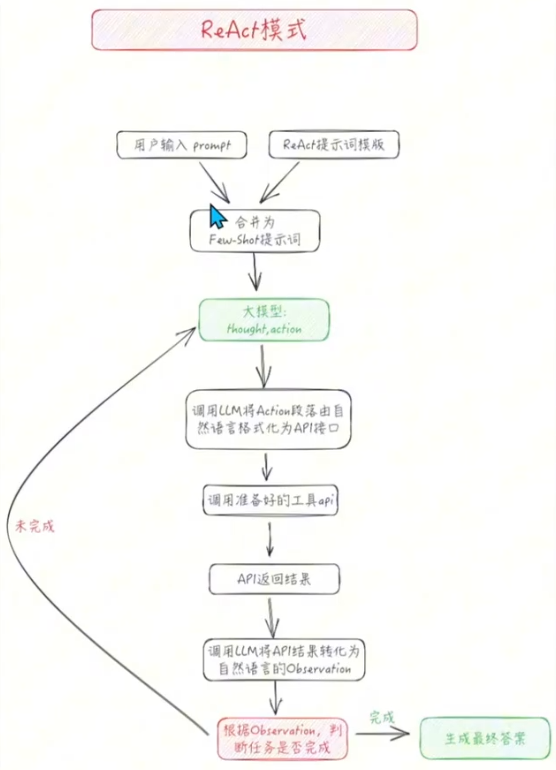

## Agent

>  产品维度

* 通用型

  > 任务发散、边界模糊的全能型智能体系统
  >
  > 开发者主要停留在“调用”层面，少有在企业内部从零构建

* 垂直型

  > 深耕细分场景的领域专家，聚焦单一业务流

> 技术架构维度

* Workflow（工作流编排）：确定性的状态机

  > 底层机制：核心为DAG（有向无环图）。开发者预定义严格的执行路径。
  >
  > 优势：具备绝对的可控性。彻底杜绝大模型因“幻觉”偏离既定流程的风险
  >
  > 适用场景：金融打款、订单审批等零容错的企业核心生产链路。在这些场景中，Workflow是目前的唯一解。
  >
  > 更适合垂直领域的Agent开发

* Agentic（智能体自驱）：黑盒决策系统

  > 底层机制：以ReAct等框架为核心。不预设固定步骤，仅提供总目标与Tools。大模型自主规划、调用、评估与重试。
  >
  > 优势：极度灵活。可解非标问题。
  >
  > 劣势：中间过程呈“黑盒”状态，极易陷入死循环或Token消耗失控。
  >
  > 适用场景：研发辅助、探索性分析。极少有架构师敢将纯Agentic逻辑直接接入核心生产数据库。
  >
  > 更适合通用型Agent开发  

### 开发方式

* 基于LLMops的可视化开发（平台级）

  > 工具：Coze、Dify、FastGPT
  >
  > 特性与场景：声明式编排，拖拉拽/适合敏捷验证MVP与非核心业务上线。Dify的私有化部署是解决中小企业数据隐私的主流方案

* 基于框架的硬核代码开发（工程级）

  > 工具：Spring AI Alibaba(Java)、LangChain(Python)
  >
  > 特性与场景：编程式调用。由后端工程师直接编写状态机，定义Function Calling接口，在代码层对接公司内网系统。

## Agent 设计模式

### Zero-Shot模式

接近C端大多数人初次体验ChatGPT时的交互模式。此模式下用户输入不增加任何Prompt template处理，直接传入大模型，并直接输出返回结果给用户

### Few-Shot模式

拥有Prompt Template逻辑，开发者可以调用大模型context-learning上下文学习能力

### ReAct模式 

> 相关论文 
>  https://arxiv.org/pdf/2210.03629
>  https://react-lm.github.io/

#### 原理

ReAct模式是一种基于大模型的智能体模式，它将大模型的推理能力与开发者的规则和逻辑相结合，形成一个智能体系统。
在没有ReAct之前，Reasoning和Action是分割开的。ReAct针对给出的问题，先进性思考，再根据思考的结果行动，如果不满足要求，再进行思考、行动，直到得到满意的结果为止。
采用few-shot in-context learning来生成解决问题的action和thought序列。
每个in-context样例是由thought、action、observation组成的。
再推理占主导的应用中，交替生成thought和action，这样完整的行为轨迹是多个thought-action-observation循环。
相反，Action占主导的应用中，thought只会在行为轨迹中最相关的位置稀疏出现

#### 实现

> 一个ReAct流程里，关键是三个概念
* Thought
  > 思考过程，大模型根据当前状态和问题，生成一个思考结果。
  > 可以根据LLM的思考，来衡量要采取的行为是否合理。
  > 这是一个可以用来判断本次决策是否合理的关键依据。thought的存在可以让LLM的决策变得更加有可解释性和可信度。
* Action
  > Action是指LLM判断本次需要执行的具体行为
  > Action一般由两部分组成：行为和对象。用编程的说法就是API名称和对应的入参。
  > LLM最大的优势是，可以根据thought的判断，选择需要使用的API并生成对应的入参。从而保证了ReAct框架在执行层面的可行性
* Observation
  > LLM框架对于外界输入获取。将外界的反馈信息同步给LLM。协助LLM进一步的做分析和决策。

一个完整的ReAct的行为，包含几个流程：
  1. 输入目标：任务的起点。可以是用户的手动输入，也可以是依靠触发器（比如系统故障报警、定时任务）
  2. LOOP：LLM开始分析问题需要的步骤（thought），按步骤执行Action，根据观察到的信息（observation），循环执行这个过程，直到判断任务目标达成。
  3. finish:任务最终执行成功。返回最终结果。

### Plan and Solve模式
> 相关论文。
>  https://arxiv.org/pdf/2305.04091
>  https://github.com/AGI-Edgerunners/Plan-and-Solve-Prompting
>  为了提升LLM的多步推理（multi-step reasoning）能力，讨论COT问题中Zero-Shot时对推理质量的提升。
>  论文首先分析了在Zero-Shot COT时的错误分布
>  其中三种错误：计算错误、步骤错误和语义理解错误占比高，其余的错误可能是因为LLM本身能力（capability）不足导致的。
>  * 计算错误 7%
>  * 步骤错误 12%
>  * 语义理解错误 27%
>
>  为了解决计算错误，提升LLM生成的推理步骤（reasoning steps）质量，又对PS promoting进行扩展，提出PS+ prompting。
    为了解决多步推理的步骤缺失问题，提出了Plan-and-Solve prompting方法，简称PS。它由两部分组成，首先设计计划，计划的目标是将整个任务划分为多个更小的子任务，然后根据计划执行子任务
#### 实现原理
这种设计模式是先有计划在执行
如果ReAct更适合完成“厨房拿酱油”的任务，那么Plan-and-Solve更适合完成“西红柿炒鸡蛋”的任务
##### 规划器
负责让LLM生成一个多步计划来完成一个大任务
代码中有Planner和Replanner，planner负责第一次生成计划，replanner是指在完成单个任务后，根据当前任务的完成情况进行replan，所以Replanner提示词中除了Zero-Shot，还会包含：目标，原有计划，已完成步骤的情况
##### 执行器
接受用户查询和规划中的步骤，并调用一个或多个工具来完成该任务

### Reason without Observation模式
> 相关论文。
>  https://arxiv.org/pdf/2305.18323
>  https://github.com/billxbf/ReWOO/tree/main
#### 原理
核心思想是将推理（Reasoning）过程与外部观察（Observation）分离。以此来提高LLM的效率和性能
REWOO模式通过以下几个步骤来优化这一过程：
1. **Planner（规划器）**
  首先，规划器接收到用户输入的任务，并将其分解为一系列的计划（Plans）。
  每个计划都详细说明了需要使用的外部工具和如何使用这些工具来获取证据或执行特定的动作
  负责生成一个相互依赖的“链式计划”，定义每一步所依赖的上一步的输出
2. **Worker（执行器）**
  执行器根据规划器提供的计划，调用相应的外部工具来执行任务，并获取必要的信息或证据
  循环遍历每个任务，并将任务输出分配给相应的变量，当调用后续调用时，它还会用变量的结果替换变量
3. **Solver（合并器）**
  合并器将所有计划的执行结果整合起来，形成对原始任务的最终解决方案

这种模块化的设计显著减少了Token消耗和执行时间，因为它允许一次性生成完整的工具链，而不是在每次迭代中重复调用LLM。此外，由于规划数据不依赖于工具输出，因此可以在不实际调用工具的情况下对LLM进行微调，进一步简化微调过程

提示词模板中给出few-shot内容中定义出每一步的plan都会依赖上一步的输出，会把前面工具的输出作为变量注入到下一步工具的提示词上下文中

### LLMCompiler模式
> 相关论文。
>  https://arxiv.org/pdf/2312.04511
>  https://github.com/SqueezeAILab/LLMCompiler

#### 实现原理
通过并行Function calling来提高效率

架构上它由三个组件组成：
* **Planner（规划器）** ：stream a DAG of tasks，即将原始问题分解为一个DAG（direct acyclic graph，有向无环图）的任务列表
* **Task Fetching Unit(并行任务执行器)** ：根据任务的依赖，调度任务并行执行
* **Joiner（合并器）** ：综合DAG执行结果反馈给用户，如果没达到预期可以重新规划任务

### Basic Reflection模式
可以类比学生（Generator）写作业，老师（Reflector）来批改建议，学生根据批改建议来修改，如此反复
Generator负责根据用户指令生成结果，Reflector负责审查Generator的生成结果并给出建议
#### 实现原理
  * Generator根据用户指令生成结果
  * Reflector接收来自Generator的生成结果，根据开发者设置的要求，给出Reflections
  * Generator再根据Reflector的Reflections，修改生成结果
  * 重复以上过程，直到达到设定循环次数

### Reflexion模式
> 相关论文。
>  https://arxiv.org/pdf/2303.11366
>  https://github.com/noahshinn/reflexion
#### 实现原理
基于提示词的强化学习，利用in-context learning的方式快速地指导模型执行任务
相当于Basic Reflection模式的升级版，使用语言反馈信号来帮助Agent从先前的失败经验中学习
Reflexion将传统梯度更新中的参数信号转变为添加在大模型上下文中的语言总结，使得agent在下一个episode中能参考上次执行失败的失败经验，从而提高agent的执行效果

Reflexion框架包含四个组成部分：
1. **Actor**：Actor由LLM担任，主要工作是基于当前环境生成下一步的动作。
2. **Evalutor**：主要工作是衡量Actor生成结果的质量。
3. **Self-reflexion**：一般由LLM担任，是Reflexion框架中最重要的部分。
它能结合离散的reward信号（如success/fail）、trajectory（轨迹，也就是推理上下文）等生成具体且详细语言反馈信号，这种信号会存储在Memory中，启发下一次Actor动作
4. **Memory**：分为短期记忆和长期记忆

Reflexion是一个迭代过程，Actor产生行动，Evaluator对Actor的行动做出评价，Self-Reflexion基于行动和评价形成反思，并将反思结果存储到长期记忆中，直到Actor执行的结果达到目标效果

**和Basic Reflection模式的区别**
  1. Reflexion模式会把之前的生成、tool调用结果、评价的所有过程数据，当作下次生成的prompt
  2. 可以通过外部工具查询数据来作为评价、修正的依据


### Language Agent Tree Search模式
> 相关论文。
>  https://arxiv.org/pdf/2310.04406
#### 实现原理
是Tree Search + ReAct + Plan&Solve
> 蒙特卡罗树搜索算法

有四个主要步骤：
1. **选择**：如果找到解决方案或达到最大搜索深度就做出响应，否则继续搜索
2. **扩展和执行**：生成N个潜在操作以并行执行它们
3. **反思+评估**：观察这些行为的结果并根据反思对决策进行评分
4. **反向传播**：根据结果更新轨迹的分数
#### 框架对比
LATS通过融合计划、思考、行动、反思、记忆，使用蒙特卡罗树搜索算法，相较ReAct、ToT、CoT、Reflection等框架具有显著优势


### Self-Discover模式
> 相关论文。
>  https://arxiv.org/pdf/2402.03620
>  https://github.com/catid/self-discover?tab=readme-ov-file

Self-Discover模式旨在使模型能够自动发现用于解决复杂问题的任务内在推理
Self-Discover模式的核心是一个自我发现过程，LLMs在这一过程中选择多个原子推理模块（如批判性思维和逐步思考）并将它们组合成一个明确的推理结构，供LLMs在解码时遵循

#### 优点
Self-Discover增强LLM处理复杂推理问题的能力，尤其是那些传统提示方法难以应对的问题
基于理论的代理推理和MATH等具有挑战性的推理基准测试上表现，相比链式推理（CoT）提高了32%
Self-Discover在效率上也超过了推理密集型方法，如CoT-Self-Consistency，同时所需的推理计算量减少10到40倍
展示了自我发现的推理结构在不同的模型家族之间具有普适性，可以从PaLM 2-L迁移到GPT-4，以及从GPT-4迁移到Llama 2

## Agent框架
### Single Agent 框架

### Multi Agent 框架

## Spring AI 

硬编码实现，灵活性低，可维护性低，需要手动管理状态，适用场景局限。若是单纯与大模型对话，已经完全足够了

## Spring AI Alibaba Agent framework

流水线方式实现，灵活性友好，可维护性友好，易用性友好，无需手动管理状态，涉及动态编排时显现不足，适用场景在不需动态Agent编排时完全足够。

Spring AI Alibaba 更推荐使用Agent Framework，基于工作流（Workflow）处理业务。它即包含Spring AI，也包含了Alibaba Graph。

## Spring AI Alibaba Graph

需要使用到动态编排，需要绝对的灵活性时

### 状态（State）

在node与edge之间传递数据，是整个Agent上下文传递数据的载体，具体实现上是一个Map<String, Object>

### 节点（Node）

Node是执行具体逻辑的单元，接受当前State作为输入，执行某些操作（如调用LLM或者自定义逻辑），并返回传递到下一个Node的State数据

### 边（Edge）

定义一个Node到下一个Node的链接，可以是固定链接（普通边），也可以是根据状态条件动态决定下一步执行路径（条件边）

## Skill

> Anthropic(Claude大模型)推出

由一个markdown文件记录需要的所有数据信息。

也可以执行一段python脚本，以cmd命令的方式执行。需要提供PythonTool工具。

内容包含两个部分：

* 元数据【名称、描述】

* 指令【编排提示词】

由大模型call_kills调用具体的Skill文件，按需加载，依旧是Function_Call调用读取文件，需要大模型支持Function call。

Skill也叫做sub-agent

Spring AI Alibaba 内置实现了Skill调用，SkillAgentHook.class

> Skill文件默认目录
>
> * 用户路径/saa/skills
> * 应用根目录/skills

需要提供 SkillsAgentHook、ShellToolAgentHook、PythonTool（如果需要执行python代码需要提供）

可以在skill.sh网站搜索已有skill

## Tools(Function call)

解决如何调用业务系统的方法

## MCP协议（调用外部tool）

规定了如何调用第三方tool方法，返回什么样的数据。

提供两种方式。stdio和http（sse/streamble）

MCP协议层约定了响应数据的统一格式。

MCP传输层约定了响应数据的传输机制。

> Stdio同一台机器上进程间交互
>
> Http协议（sse协议 单向实时通信，由服务端以流的方式多次向客户端发送数据）

## A2A协议

## ReactAgent

> 能够自主规划，自主决策，能执行工具，有记忆能力，感知周边环境的智能体

ReactAgent.builider().build();创建，在ai和webflux框架中存在大量的建造者模式。

### name

智能体名称

### model

指定使用的大模型

### tool

可以使用的工具

### 远程Agent获取流程

1. 服务提供者将智能体卡牌存储到注册中心
2. 服务消费者通过AgentCardProvider的getAgentCard方法基于远程智能体的name获取对应的智能体卡片
3. 注册中心根据获取到的卡片，告诉远程Agent执行消费者的任务

## LLM参数调优

* Temperature

  > 温度。调整候选Token集合的概率分布
  >
  > 低值（0.2）适用于标准化回答。如退货政策查询
  >
  > 高值（0.8）适用于创意场景。如促销文案生成

* Top_p

  > 控制候选Token的采样范围

* Top_k

  > 在通义千问系列模型中，参数topk也有类似topp的能力。
  >
  > 它是一种通过采样机制，从概率排名前k的Token中选择一个进行输出
  >
  > topk越大，生成内容越多样，topk越小，内容越固定
  >
  > topk设置为1时，仅选择概率最高的Token进行输出，内容更加稳定，但也缺乏变化和创意。

## Higress AI网关

## Rag知识库，相似性检索

> 向量、向量模型、向量数据库

> 余弦相似度：通过从0点坐标到任意两个空间之间的夹角来判断相似度，夹角度数越小越相似

## 分片

> 企业级RAG最佳分片策略？
>
> 建议提供多种分片策略拱用户自行选择，并提供自由填写参数和分片预览

### 固定长度

无视语义，按既定字符数或token数执行硬性物理切分

### 结构感知切分

将文档结构标记（如Headers、HTML标签）作为硬性语义边界进行切分

### 语义切分

实时计算文本向量，基于embedding相似度的剧烈变化点进切分

* 按照特定标点符号
* 按照自然语言处理工具或框架。如：Apatch NLP
* 按照文本向量计算余弦相似度

### 递归字符切分

分治法。遵循优雅的降级策略：先按段落切分，失败则按句子分，再失败则按词切分。

### LLM-based Chunking（基于大模型的智能切分）

代理化。让LLM深度阅读并理解上下文逻辑后，自主决定切分边界。

## RAG知识库问题

1. 跨片段topk上限

   * 适当调大
   * 分而治之。分批处理，无限扩展

2. 聚合问题。text-to-sql(查询关系型数据库)

   > 多路召回

   * super-sql。RAG，首次启动时读取指定的数据库所有的表结构，将每一张表的信息（表名、字段名、字段类型...）存储到向量数据库中。
   * 大模型处理用户输入，检查是否是一个聚合问题，RAG检索相关的表信息，将检索到的表信息告诉LLM，LLM利用表信息生成SQL语句并验证SQL语句的有效性，最终执行SQL语句，从数据库中获取数据

3. 噪音问题

   * 知识库隔离（进行分类）
   * 元数据过滤（filterExpression）

4. 知识库文档更新

   * 文件传错。删除对应的文档（向量、物理文件、数据库信息）
   * 文件过期。不需要删除，预留检索往期文档，上传新文档，注意区分新旧文档

5. 幻觉问题

## LangChain

 

### Anaconda3

```cmd

conda create -n evn_name python=3.10 
conda activate env_name

conda config --add channels https://mirrors.tuna.tsinghua.edu.cn/anaconda/pkgs/free
conda config --add channels https://mirrors.tuna.tsinghua.edu.cn/anaconda/pkgs/main/
conda config --set show_channel_urls yes 
```


